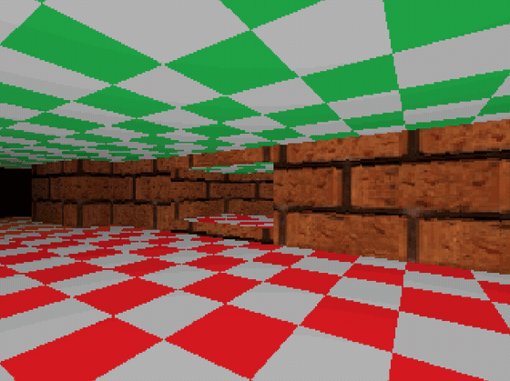
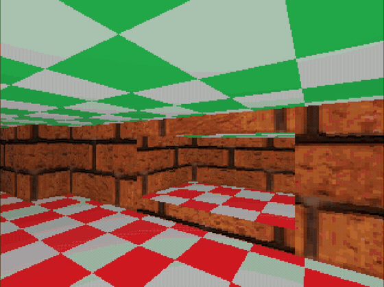

# DoomLikeEngine

[](#requirements)
[](#tech-stack)
[](#building)
[](#project-status)
[](#license)

**Read this in other languages:** [Español](README.es.md)

A hand-rolled, from-scratch **Doom-style 2.5D game engine** and a **map editor**, written in C++20 with no external math library. Originally built using plain GDI and Windows Forms for the editor, now migrating to SDL3 and Dear ImGui.
The goal is to reproduce the classic sector/portal rendering approach of id Software's *Doom* (BSP trees, sector-based maps, wall/floor/ceiling raycasting) as an exercise and learning project.

---

## Table of Contents

- [Demo](#demo)
- [Overview](#overview)
- [Features](#features)
- [Project Structure](#project-structure)
- [Tech Stack](#tech-stack)
- [Requirements](#requirements)
- [Building](#building)
- [Running](#running)
- [Project Status](#project-status)
- [Roadmap](#roadmap)
- [Contributing](#contributing)
- [License](#license)
- [Acknowledgments](#acknowledgments)

---

## Demo

**Current Working Preview**



**Step by Step Rendering** — a sped-up look at how each pixel is rendered by the engine.



---

## Overview

DoomLikeEngine is split into two cooperating pieces:

1. **The Engine (`DoomCopy`)** — a real-time game runtime that loads compiled binary maps (`.bsp`) and renders them with a custom 2.5D raycasting/software-rendering pipeline.
2. **The Editor (`Editor`)** — a native ImGui-based level editor for authoring sector-based maps (`.map`), drawing sectors/walls, editing entity and geometry properties, and compiling maps down to the engine's runtime `.bsp` format.

Everything — vectors, colors, transforms, BSP math, sector triangulation — is written from scratch in the shared `Core` library, without pulling in GLM or any other math dependency.

## Features

### Engine (`DoomCopy`)
- Custom software/SDL3-backed 2.5D renderer (wall, floor and ceiling rendering)
- Sector-based world representation (`World`, `WorldTypes`) instead of a fully generic 3D scene graph
- Simple component-based game object model (`GameObject`, `Component`, `TransformComponent`, `CameraComponent`)
- Fixed-timestep game loop with frameskip (`DEFAULT_TICKS_PER_SECOND`, `MAX_FRAMESKIP`)
- Custom input handling (keyboard + mouse look)
- Loads precompiled `.bsp` map files produced by the Editor

### Editor
- Native C++ / SDL3 / Dear ImGui (docking) desktop application
- Interactive sector & wall drawing tools with pending-sector previews
- Custom **ear-clipping triangulation** for arbitrary (non-convex) sector polygons
- Segment-intersection-aware drawing (prevents self-intersecting / overlapping sector walls)
- Selection manager for picking and editing nodes, walls and sectors
- Properties panel for inspecting/editing map object data
- Undo/redo command history (`CommandHistory`, `EditorCommands`)
- Configurable hotkeys and editor theme (`EditorHotKeys`, `EditorTheme`)
- Map file I/O (`.map`) and a **BSP compiler** that turns editable maps into the engine's runtime `.bsp` format

### Core (shared library)
- Hand-rolled math primitives: `Vector2`, `Vector3`, `Vector2Int`, `Color` (no GLM / external math lib)
- Vector/geometry helpers used by both the editor and the engine (segment intersection, point-in-segment tests, etc.)
- Shared world data types and `.bsp` file I/O

### Legacy editor (`LevelEditor`)
- An earlier C# / .NET 8 WinForms map editor, **superseded by the native `Editor`**
- Kept in the repository for reference; not under active development

## Project Structure

```
DoomCopy/
├── Core/            # Shared static library: math, world types, BSP file I/O
├── DoomCopy/         # The game/engine executable (renderer, game loop, entities)
├── Editor/           # Native C++/SDL3/ImGui map editor (active development)
├── LevelEditor/      # Legacy C#/.NET 8 WinForms editor (superseded, kept for reference)
├── CMakeLists.txt    # Root build script (FetchContent: SDL3, Dear ImGui, COLogger)
└── CMakePresets.json # x64-debug / x64-release presets (Visual Studio 17 2022, Windows only)
```

## Tech Stack

| Area              | Technology                                    |
|-------------------|------------------------------------------------|
| Language           | C++20                                          |
| Windowing / Input  | [SDL3](https://github.com/libsdl-org/SDL)      |
| Editor UI          | [Dear ImGui](https://github.com/ocornut/imgui) (`docking` branch) |
| Logging            | [COLogger](https://github.com/FedeVega1/COLogger) |
| Build system       | CMake 3.20+ with `FetchContent`                |
| Legacy tooling     | C# / .NET 8 (WinForms)                         |
| Math               | Custom — no GLM |

## Requirements

- **Windows** (this project currently only targets Windows — CMake presets gate on it)
- **Visual Studio 2022** or  **Visual Studio 2026** (generator: `Visual Studio 17 2022`)
- **CMake 3.20+**
- An internet connection for the first configure (CMake `FetchContent` pulls SDL3, Dear ImGui and COLogger from GitHub)
- .NET 8 SDK, only if you intend to build the legacy `LevelEditor`

## Building

```bash
# Configure (choose one)
cmake --preset x64-debug
cmake --preset x64-release

# Build
cmake --build out/build/x64-debug
```

Alternatively, open the generated solution directly in Visual Studio 2022 or Visual Studio 2026:

```
out/build/x64-debug/DoomLikeEngine.sln
```

> ⚠️ Opening the solution defaults to running **`DoomCopy`** (the game), not the **`Editor`** — switch the startup project in Visual Studio's Solution Explorer if you want to run the editor instead.

Output binaries are placed in:

```
bin/<Project>/<Config> - x64/
```

(note the literal space in the configuration directory name, e.g. `bin/Editor/Debug - x64/`)

## Running

- **Play/test a compiled map:** run the `DoomCopy` executable — it currently loads a hardcoded default map on startup called asd, this will change in the future.
- **Author or edit a map:** run the `Editor` executable, draw sectors/walls, edit properties, and use its BSP compiler to produce a `.bsp` the engine can load.

## Project Status

This is an actively evolving hobby project — expect rough edges, especially around:

- **Sector drawing & triangulation** (`Editor/src/MapRenderer.cpp`, `Editor/src/MapData.cpp`, `Editor/src/MapView.cpp`) — this area has needed repeated follow-up fixes and should be treated as fragile.
- Manual bookkeeping between `wallAdjacency` and `usedWalls` in `MapData` — nothing enforces consistency automatically, so every wall/sector add/remove must update both.

## Roadmap

# Engine

- [ ] Texture-mapped wall/floor/ceiling rendering polish
- [ ] Entity/gameplay systems beyond basic components
- [ ] Sprite rendering for objects
- [ ] Main menu and HUD
- [ ] Level Selection, remove hardcoded map load

# Editor

- [ ] More robust sector triangulation & self-intersection handling
- [ ] Retire or fully replace the legacy `LevelEditor`
- [ ] Automated tests for `Core` math and BSP compilation
- [ ] Entity placement

## Contributing

This is currently a personal/solo project and not set up for external contributions, but issues, suggestions and forks are welcome.

## License

This project is licensed under the [MIT License](LICENSE).

## Acknowledgments

- [SDL3](https://github.com/libsdl-org/SDL) — windowing, input and rendering backend
- [Dear ImGui](https://github.com/ocornut/imgui) — immediate-mode GUI for the editor
- id Software's *Doom* and *Wolfenstein 3D* — the classic engines this project draws inspiration from
